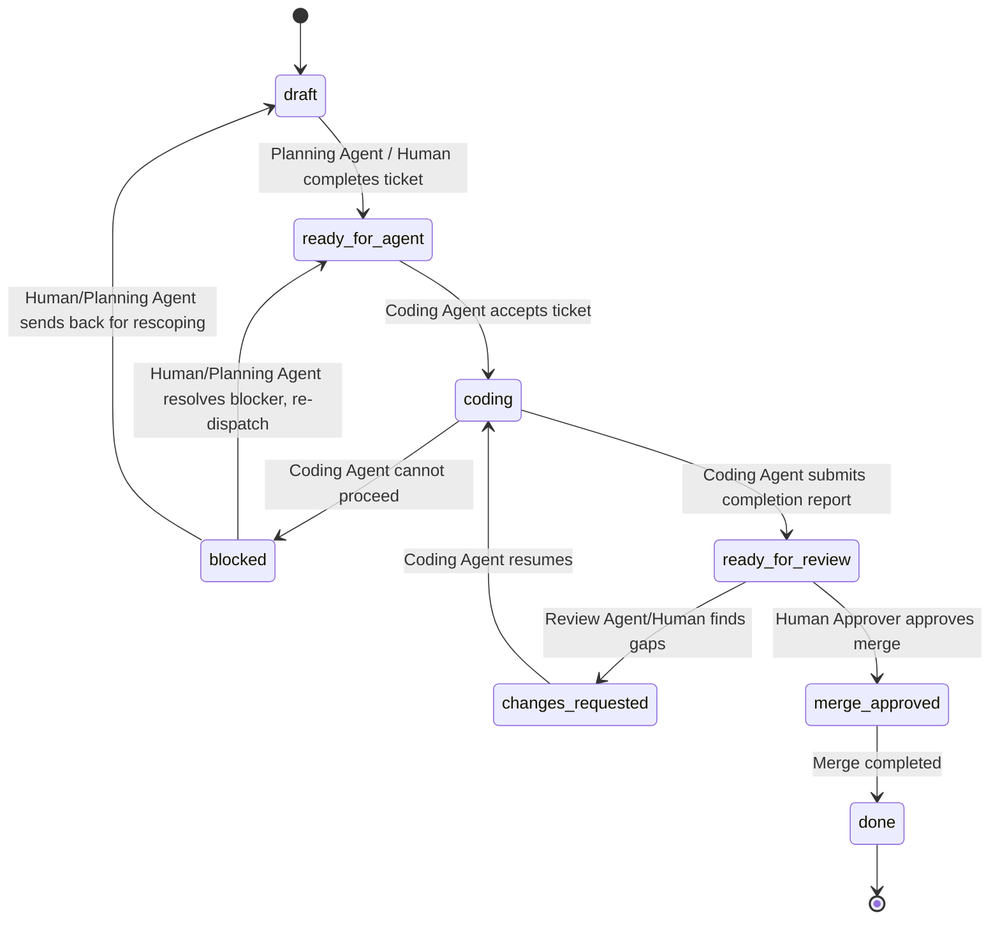

# Coding Agent Task Protocol (v1)

## Status

Conceptual specification, v1. This document defines a protocol, a state
machine, fixed ticket/report formats, and a human-approval boundary. It does
not implement a runner, orchestrator, GitHub API integration, webhook,
polling loop, scheduler, or persistence layer. No automation described here
exists yet; every transition and record in this document is currently
performed by a human copying text between a planning surface and a Coding
Agent.

## Purpose

Reduce manual copy-paste between a planning surface (an AI Manager session, a
human, or a future Planning Agent) and a Coding Agent (Claude Code, Codex,
Gemini CLI, or another tool), by defining:

- one fixed engineering-ticket format any Coding Agent can consume;
- one fixed completion-report format any Coding Agent can produce;
- one task state machine that every participant observes the same way;
- one human-approval boundary that never depends on which Coding Agent is
  used;
- GitHub Issue as the single task source, so task state does not fragment
  across chat windows.

This is a governance and data-contract specification. It is deliberately
provider-neutral and agent-neutral: AI Manager is the management brain, and
Hermes, any orchestrator/runner, and every Coding Agent are replaceable
adapters around it.

## Non-Goals for v1

v1 does not:

- implement the GitHub Issue API, a webhook receiver, or a polling loop;
- implement a runner or adapter for Claude Code, Codex, Gemini CLI, or any
  other Coding Agent;
- modify, start, or depend on Hermes;
- create a scheduler, background service, or database;
- build a UI or dashboard;
- implement quota-aware dispatch or agent selection logic;
- implement a usage/cost tracker or an automated model-dispatch policy (see
  Deterministic-First: Code vs. AI Boundary — this document defines the
  principle and the data fields only);
- implement automated review;
- perform an automatic `git push`, merge, or deployment;
- select which Coding Agent should run a given ticket (that is a Decision
  Engine / Resource Manager concern, out of scope here).

Later versions may implement any of the above. This document only defines the
contract they must satisfy when they do.

## Relationship to the AI Continuity Layer Handoff Protocol

[HANDOFF_PROTOCOL.md](../continuity/HANDOFF_PROTOCOL.md) already defines a
"Handoff Protocol" term inside the AI Continuity Layer. That protocol and this
one solve different problems and must not be conflated:

| | AI Continuity Layer Handoff Protocol | Coding Agent Task Protocol (this document) |
| --- | --- | --- |
| Question it answers | An agent hit a quota/context/session limit mid-task — how does another agent resume the *same* unit of work without losing state? | How does an engineering task move from a planning surface to a Coding Agent, through review, to a human-approved merge? |
| Unit of continuity | Working Memory (in-progress reasoning, evidence, open questions) | An engineering ticket bound to a GitHub Issue, a branch, and a base SHA |
| Trigger | Quota exhaustion, context pressure, session end, explicit reassignment | Planning Agent or human marks a ticket `ready-for-agent` |
| Scope | Within one task, across two agent *sessions* | Across one task's full lifecycle, across multiple *roles* (Planning Agent, Coding Agent, Review Agent, Human Approver) |
| Owning layer | Resource Layer (AI Continuity Layer) | Execution Layer (this protocol governs dispatch to and return from external Coding Agents) |

A single engineering ticket may internally trigger an AI Continuity Layer
handoff (e.g., the Coding Agent working the ticket hits a quota limit and
hands off to another agent instance mid-`coding` state). That internal
handoff is governed by `HANDOFF_PROTOCOL.md` and does not change the ticket's
state in this protocol. This document never overrides or duplicates the
Continuity Layer's Handoff Package format.

## Roles and Responsibilities

| Role | Responsibility | Authority Boundary |
| --- | --- | --- |
| Planning Agent | Turns a goal into an engineering ticket: goal, context, allowed/forbidden changes, verification, approval requirements. Sets `ready-for-agent`. | Cannot set `merge-approved`. Cannot push or merge. |
| AI Manager | Owns ticket-format validation, state-machine enforcement, agent-neutral policy, and the approval boundary defined here. | Does not select a specific Coding Agent's internal reasoning or execute providers directly; that is Resource Manager / AI Router scope, unchanged by this document. |
| Orchestrator / Runner | Optional, replaceable dispatcher and monitor (e.g., a future Hermes capability, a CLI script, or a human). Moves a ticket between AI Manager and a Coding Agent, observes progress, and reports status. | Not a system dependency. AI Manager must function (manually) with no Orchestrator/Runner present. Cannot set `merge-approved`. |
| Coding Agent | Any tool that reads an engineering ticket and produces changes plus a completion report (Claude Code, Codex, Gemini CLI, or a successor). Interchangeable by contract. | Operates only inside `allowed_changes`. Cannot push, merge, deploy, or touch production/secrets/paid resources without a human approval already recorded on the ticket. |
| Review Agent | Optional AI or human reviewer that inspects a completion report and diff against the ticket's verification and scope, and emits a review report. | Can recommend `changes-requested` or recommend the ticket for `merge-approved`. Cannot itself set `merge-approved`. |
| Human Approver | The accountable human. | Sole role permitted to trigger `merge-approved`, to approve `push`, merge, deployment, cloud-resource changes, migrations against shared/cloud databases, secrets/production/real-data operations, paid operations, remote deletions, and scope expansions. |
| GitHub Issue / PR | The task's system-of-record artifact, not an actor. | Holds the current ticket, its status, and its event history. A PR references its Issue; it does not replace it. |

AI Manager and any Orchestrator/Runner must apply the Deterministic-First
boundary defined below before invoking any Agent — most of the actions in
this table's "Responsibility" column are deterministic-code operations, not
AI calls.

## GitHub Issue as the Single Task Source

- Every engineering ticket corresponds to exactly one GitHub Issue. The Issue
  body (or a pinned comment) holds the current ticket in the fixed format
  defined below.
- The Issue, not a chat transcript, is authoritative for a ticket's current
  status, history, and approvals. Any chat session (planning or coding) that
  disagrees with the Issue must defer to the Issue.
- Status changes, completion reports, and review reports are appended to the
  Issue as comments (or written back to the Issue body, once an orchestrator
  exists to do so). v1 does not implement this write-back; it only requires
  that the format is Issue-comment-ready.
- A repository may have many open tickets. Each is independent unless a
  ticket explicitly declares a dependency on another ticket's `done` state.

## Provider-Neutral / Agent-Neutral Design

- The engineering ticket and completion report formats defined in this
  document (and their template files) contain no field, instruction, or
  assumption specific to Claude Code, Codex, Gemini CLI, or any other tool.
- "Coding Agent" in the state machine and templates always means "whichever
  tool is assigned," never a named product.
- Hermes and any orchestrator/runner are Adapters/Runners in the sense of
  [GLOSSARY.md](GLOSSARY.md)'s Plugin and Agent definitions: replaceable,
  never a required dependency of AI Manager, and never a source of policy
  authority over this protocol.
- State names use `ready-for-agent`, not `ready-for-codex` or any
  tool-specific label, precisely to keep the state machine tool-neutral.

## Deterministic-First: Code vs. AI Boundary

This is a repo-wide architecture principle for AI Manager, not an
implementation detail — recorded as
[Principle 17](../product/PRINCIPLES.md#17-deterministic-first-ordinary-code-moves-state-by-default)
in `PRINCIPLES.md` and as
[ADR-0002](../decisions/ADR-0002-deterministic-first.md), and applied here to
the Coding Agent task lifecycle specifically: **ordinary deterministic code
handles what ordinary code can handle; AI is invoked only when semantic
understanding or content generation is actually required.**

Reducing manual copy-paste (this protocol's stated Purpose) must not be
achieved by adding an Orchestrator/Runner or Hermes layer that consumes more
model calls and tokens than the manual process it replaces. An
Orchestrator/Runner that calls an AI model to move a ticket between states,
check a timestamp, or reformat already-structured data has violated this
protocol, even if every other rule in this document is satisfied.

### Must Be Deterministic Code — Never an AI Call

- Reading and updating the GitHub Issue and its labels.
- Required-field and schema validation of tickets and reports (see
  Engineering Ticket Format, Completion Report Format).
- Repository, branch, and Base SHA comparison.
- Legality checks for state-machine transitions (see State Transition
  Table) — whether a requested transition is defined at all.
- `lastActivityAt` evaluation and timeout detection.
- Retry-count tracking and enforcement of the declared attempt limit.
- Duplicate-dispatch detection (see Idempotency / Avoiding Duplicate
  Dispatch).
- Mechanical path matching against declared Allowed/Forbidden changes.
- Persisting commits, verification results, and audit events.
- Fixed-format notifications (e.g., posting a templated status comment).

### May Invoke AI — Only for Semantic Understanding or Generation

- Understanding a goal and decomposing it into an engineering ticket.
- Judging ambiguity, missing evidence, or an architectural conflict.
- Modifying code or documentation.
- Diagnosing a complex failure.
- Semantic code review (as opposed to the mechanical scope/verification
  checks a Review Agent also performs).
- Producing a summary or recommendation that fixed rules cannot produce.

### Constraints on AI Invocation

- Every AI call must have an explicit purpose and must be attributable to a
  specific ticket. A call with no ticket to attribute to should not happen.
- AI must not be invoked solely to move data, relabel an Issue, evaluate a
  timestamp, or reformat data that is already structured — those are
  deterministic-code responsibilities listed above.
- An Orchestrator/Runner must never replay a full conversation history to a
  different Agent. Each Coding Agent invocation receives only: the
  engineering ticket, the specific documents it references, the relevant
  diff, and the minimum context the task requires — never a full chat
  transcript from a prior agent or session.
- Hermes, or any future Orchestrator/Runner, must remain a replaceable
  executor (see Provider-Neutral / Agent-Neutral Design above). It must not
  become an AI-inference layer invoked on every state transition. Most state
  transitions in this protocol (see Task State Machine) are deterministic by
  construction and require no model call; only the roles marked as invoking
  judgment (Planning Agent's ticket authoring, Coding Agent's work, Review
  Agent's semantic review, Human Approver's decision) involve understanding
  rather than mechanical evaluation.

### Audit Trail Additions for AI Calls

Every AI call an Orchestrator/Runner makes should be attributable in the
audit trail defined below (see Audit Trail / Minimum Event Log Contract),
including which model was called and why. This is a data-contract addition
only — v1 does not implement a usage tracker, cost dashboard, or
model-dispatch policy; those remain a future Resource Manager / AI Router
concern.

## Task State Machine

Exactly one state is active for a ticket at any time. A ticket never holds
two states simultaneously, and no state is entered implicitly — every
transition below is explicit and attributable to a role.

### State Definitions

| State | Meaning |
| --- | --- |
| `draft` | Ticket is being written. Required fields may be incomplete. Not yet actionable by a Coding Agent. |
| `ready-for-agent` | Ticket is complete and validated (see Engineering Ticket Format). Any eligible Coding Agent may accept it. |
| `coding` | A specific Coding Agent has accepted the ticket and is actively working it. |
| `blocked` | The Coding Agent (or Orchestrator/Runner) has determined it cannot proceed without a decision, resource, or clarification it is not authorized to make. |
| `ready-for-review` | A completion report has been submitted against the current commit SHA. |
| `changes-requested` | Review found the work incomplete, out of scope, or failing required verification. |
| `merge-approved` | A Human Approver has explicitly approved merge. This is a human-only gate, not a computed state. |
| `done` | The approved change has been merged (or otherwise landed) and the ticket is closed. |

### State Transition Table

| Current State | Can Enter | Who Can Trigger | Required Conditions | System Action | On Failure |
| --- | --- | --- | --- | --- | --- |
| (none) | `draft` | Planning Agent or Human | A GitHub Issue exists | Issue created/labeled as a ticket | N/A |
| `draft` | `ready-for-agent` | Planning Agent or Human | All required ticket fields present and non-vague (see Engineering Ticket Format); Base SHA resolves to a real commit on Base branch | AI Manager validates ticket format | Stays in `draft`; validation errors reported back to the author |
| `ready-for-agent` | `coding` | Coding Agent (via Orchestrator/Runner, or a human pasting the ticket in) | Ticket not already claimed by another Coding Agent; work branch created from Base SHA | Attempt counter incremented; `startedAt` recorded | If claim conflicts with another in-progress attempt, reject the claim (see Idempotency) |
| `coding` | `blocked` | Coding Agent or Orchestrator/Runner | Coding Agent identifies a decision, missing approval, missing resource, or ambiguity outside its authority | Exit reason recorded; ticket returns to human/Planning Agent attention | N/A — this is itself the failure/escalation path |
| `coding` | `ready-for-review` | Coding Agent | Completion report submitted in fixed format, referencing a final commit SHA on the work branch | `completedAt` recorded; verification summary attached | If the completion report is malformed or missing required fields, ticket is rejected back to `coding`, not advanced |
| `blocked` | `ready-for-agent` | Human or Planning Agent | Blocking issue explicitly resolved and recorded | New attempt begins; prior blocked reason preserved in history | N/A |
| `blocked` | `draft` | Human or Planning Agent | Ticket scope itself needs to change | Ticket edited; prior attempt history preserved | N/A |
| `ready-for-review` | `changes-requested` | Review Agent or Human | Verification fails, scope exceeded, or completion report incomplete | Findings recorded in a review report | N/A — this is the failure path |
| `ready-for-review` | `merge-approved` | **Human Approver only** | All required verification passed; scope confirmed within Allowed changes; no unresolved Deviations | Approval recorded with approver identity and timestamp | If any required condition is unmet, the Human Approver must not trigger this transition |
| `changes-requested` | `coding` | Coding Agent | Same Coding Agent (or a newly assigned one) resumes against the same ticket and branch | Attempt counter incremented | Subject to the same retry/attempt limits as any other `coding` entry |
| `merge-approved` | `done` | Whoever performs the merge (human, or automation explicitly authorized by a future version) | Merge completed against the approved commit SHA | Ticket closed; final state recorded | If merge fails (conflict, CI failure), ticket returns to `changes-requested`, not `done` |

No other transition is defined. A ticket found in an undefined state or
attempting an undefined transition must be treated as invalid and returned to
a human for correction; it must never be silently forced into a next state.

### Merge Gate

`merge-approved` is a human-only transition. No system action, Review Agent
recommendation, or passing verification result may set this state by itself.
Nothing in this protocol may merge into `main` without a ticket first
reaching `merge-approved`.

### Blocked Is Not a Retry Loop

`blocked` never re-attempts automatically. Leaving `blocked` always requires
an explicit human or Planning Agent action (resolve and re-dispatch, or
rescope back to `draft`). A ticket must never cycle `coding` → `blocked` →
`ready-for-agent` → `coding` without that intervening explicit decision, even
if an Orchestrator/Runner exists in a later version.

## Engineering Ticket Format

The fixed template is
[ENGINEERING_TICKET_TEMPLATE.md](../templates/ENGINEERING_TICKET_TEMPLATE.md).
Every ticket, regardless of the target Coding Agent, uses this format so it
can be pasted into an Issue body and read by any tool.

Required fields (a ticket missing any of these cannot leave `draft`):

- Ticket ID
- Title
- Repository
- Base branch
- Base SHA
- Work branch
- Goal
- Context
- Allowed changes
- Forbidden changes
- Required verification
- Approval requirements
- Completion report (pointer/placeholder until submitted)
- Timeout/retry policy
- Current status

`Base SHA`, `Allowed changes`, `Forbidden changes`, and `Required
verification` are non-negotiable required fields:

- `Base SHA` must be an actual resolvable commit hash, not a branch name or
  "latest".
- `Allowed changes` and `Forbidden changes` must be specific (file paths,
  directories, or explicit categories of change), never a placeholder like
  "TBD" or a vague phrase like "reasonable changes."
- `Required verification` must list concrete, runnable commands or explicit
  manual checks (e.g., `npm test`, `git diff --check`, "manually confirm link
  X resolves"), never a vague completion phrase like "make sure it works."

A ticket that uses vague language in these four fields fails validation and
must stay in `draft`.

## Completion Report Format

The fixed template is
[COMPLETION_REPORT_TEMPLATE.md](../templates/COMPLETION_REPORT_TEMPLATE.md).

Required fields:

- Ticket ID
- Agent/Provider
- Branch
- Base SHA
- Final commit SHA
- Changed files
- Summary
- Verification commands and results
- Scope/security confirmation
- Deviations
- Known limitations
- Final git status
- Recommended next state

A completion report is written back as a GitHub Issue comment (once
write-back automation exists) and is what moves a ticket from `coding` to
`ready-for-review`.

## Review Report Format

v1 defines this format inline rather than as a separate template, since it is
produced against an existing ticket and completion report rather than
authored from scratch.

A review report includes:

- Ticket ID
- Reviewer identity (Review Agent name/version, or human)
- Reviewed commit SHA
- Verification results: pass/fail against each item in the ticket's Required
  verification
- Scope compliance: confirmation that the diff stays within Allowed changes
  and does not touch Forbidden changes
- Deviations acknowledged or disputed (cross-referenced against the
  completion report's own Deviations field)
- Blocking issues (if any) — required before `merge-approved` can be
  considered
- Non-blocking notes
- Recommended next state: `changes-requested` or "recommend for
  `merge-approved`" (a recommendation only; the Review Agent cannot set
  `merge-approved` itself)

## Human Approval Boundary

### v1 may perform automatically

- Validating engineering ticket format against the required fields above.
- Creating a feature/work branch from the declared Base SHA.
- Modifying code or documentation within the ticket's declared Allowed
  changes.
- Running lint, build, test, and `git diff --check`.
- Creating a commit on the work branch.
- Writing execution results back to the Issue (once that automation exists).
- Updating ticket status for any state transition not reserved for a human
  below.

### v1 requires human approval before

- `git push` to any remote branch.
- Merging into `main` (or any protected branch).
- Any production deployment.
- Creating or modifying cloud resources.
- Running a migration against a shared or cloud database.
- Any operation touching secrets, production accounts, or real user data.
- Any paid/billed operation.
- Deleting a remote branch or remote data.
- Expanding a ticket's declared Allowed changes.

Whether `push` requires human approval is a repository-policy choice that a
future version may make configurable. **This protocol's v1 default is that
push requires human approval.** Any future change to that default must be
made explicitly in repository policy documentation, not silently assumed by
an Orchestrator/Runner or Coding Agent.

## Blocked, Timeout, Retry, and Idempotency Rules

### Blocked

A ticket enters `blocked` when the Coding Agent (or Orchestrator/Runner)
determines it cannot proceed without a decision, approval, resource, or
clarification outside its authority (see State Transition Table). Blocked
tickets require an explicit human or Planning Agent action to resume; see
"Blocked Is Not a Retry Loop" above.

### Timeout

Each ticket declares its own timeout/retry policy in its `Timeout/retry
policy` field (e.g., "no activity for 4 hours ⇒ treat as stalled"). v1 does
not implement a clock or automated timeout enforcement; it only requires that
every ticket states this policy so a human or future Orchestrator/Runner can
apply it consistently.

### Retry

- Every ticket tracks an `attempt` counter, starting at 1.
- A ticket's `Timeout/retry policy` field declares the maximum attempts
  permitted before the ticket must be escalated to a human rather than
  re-dispatched again.
- Reaching the declared maximum attempts moves the ticket to `blocked` with
  exit reason "retry limit reached," not back to `ready-for-agent`.

### Idempotency / Avoiding Duplicate Dispatch

- A ticket in `coding` or `ready-for-review` must not be re-dispatched to a
  second Coding Agent concurrently. Any Orchestrator/Runner (or human) must
  check the ticket's Current status before dispatch.
- Re-dispatch after `blocked` or `changes-requested` must increment the
  `attempt` counter rather than silently repeating the same attempt number,
  so the audit trail can distinguish attempts.
- A duplicate claim attempt on a ticket already in `coding` must be rejected,
  not queued or silently merged with the active attempt.

## Branch, Base SHA, Commit, and Issue Correlation

- Every ticket names a `Base branch`, a `Base SHA` (the exact commit the work
  branch is created from), and a `Work branch` name.
- Every commit produced for a ticket should reference the Ticket ID (for
  example, in the commit message), so history is traceable back to the
  originating Issue without relying on branch naming conventions alone.
- The completion report records the `Final commit SHA` — the exact commit
  reviewed and, if approved, merged.
- The GitHub Issue is the durable link between all of the above: ticket,
  branch, commits, completion report, review report, and approval all
  reference the same Issue number.

## Allowed/Forbidden Scope and Boundary Detection

- `Allowed changes` and `Forbidden changes` are required, specific fields on
  every ticket (see Engineering Ticket Format).
- v1 does not implement automated policy enforcement of these boundaries. In
  v1, boundary detection is a human/Review Agent responsibility: compare the
  actual diff against the ticket's declared Allowed/Forbidden changes before
  approving `merge-approved`.
- A Coding Agent that determines it must touch something outside Allowed
  changes must record this in the completion report's `Deviations` field
  rather than silently expanding scope. Expanding a ticket's Allowed changes
  is itself a human-approval-required action (see Human Approval Boundary).
- A completion report with an undisclosed deviation discovered later by
  review must move the ticket to `changes-requested`, not `merge-approved`.

## Audit Trail / Minimum Event Log Contract

This section defines the data a future Orchestrator/Runner must be able to
record. v1 defines this contract only; it does not create a database, file
store, or persistence mechanism.

Minimum fields per ticket:

| Field | Description |
| --- | --- |
| `ticket_id` | Unique ticket identifier, matching the GitHub Issue. |
| `repository` | Target repository. |
| `issue_number` | GitHub Issue number. |
| `status` | Current state-machine state. |
| `selected_agent` | Which Coding Agent (tool/provider) is assigned, if any. |
| `branch` | Work branch name. |
| `base_sha` | Base commit SHA the work branch was created from. |
| `started_at` | Timestamp the current attempt entered `coding`. |
| `last_activity_at` | Timestamp of the most recent recorded event. |
| `completed_at` | Timestamp the ticket reached `ready-for-review`. |
| `attempt` | Current attempt number. |
| `exit_reason` | Why the current attempt ended (completed, blocked, timeout, retry-limit, rejected). |
| `commit_sha` | Final commit SHA associated with the current attempt. |
| `verification_summary` | Pass/fail summary against Required verification. |

Additional fields per AI call (see Deterministic-First: Code vs. AI Boundary
— these apply only to calls that actually invoke an AI model, not to
deterministic-code actions):

| Field | Description |
| --- | --- |
| `model` | The specific model invoked for this call, when known. |
| `call_reason` | Why this AI call was made; must map to one of the "May Invoke AI" categories in Deterministic-First: Code vs. AI Boundary. |
| `usage_cost_metadata` | Token usage / cost metadata, when obtainable from the provider. Absence must remain visible as "unknown," never silently treated as zero cost. |

## v1 Boundary and Future Versions

v1 defines protocol, state machine, formats, and approval boundary only.
Explicitly out of scope for v1 (see Non-Goals above): GitHub Issue API and
webhook/polling implementation, any Coding Agent runner, Hermes integration,
scheduling/queueing, persistence, UI, quota-aware agent selection, automated
review, and any automatic push/merge/deploy.

A future version may implement:

- an Orchestrator/Runner that reads/writes GitHub Issues automatically;
- Hermes as one possible (optional, replaceable) implementation of that
  Orchestrator/Runner role;
- automated boundary detection against Allowed/Forbidden changes;
- automated timeout enforcement;
- integration with Resource Manager for Coding Agent selection;
- Mission Control visibility into ticket state (parallel to the AI
  Continuity Layer's N4 integration).

Any such version must continue to satisfy this document's state machine,
required ticket/report fields, and human-approval boundary unless this
document is revised through the same documentation-first review process
described in [CONTRIBUTING.md](../../CONTRIBUTING.md).

## Related Documents

- [Product Principles](../product/PRINCIPLES.md) — Principle 17 records
  Deterministic-First as a repo-wide rule.
- [ADR-0002: Deterministic-First](../decisions/ADR-0002-deterministic-first.md)
- [Handoff Protocol (AI Continuity Layer)](../continuity/HANDOFF_PROTOCOL.md)
- [Continuity Architecture](../continuity/CONTINUITY_ARCHITECTURE.md)
- [Component Contracts](COMPONENT_CONTRACTS.md)
- [System Overview](SYSTEM_OVERVIEW.md)
- [System Boundaries](SYSTEM_BOUNDARIES.md)
- [Glossary](GLOSSARY.md)
- [Roadmap](../roadmap/ROADMAP.md)
- [Engineering Ticket Template](../templates/ENGINEERING_TICKET_TEMPLATE.md)
- [Completion Report Template](../templates/COMPLETION_REPORT_TEMPLATE.md)
