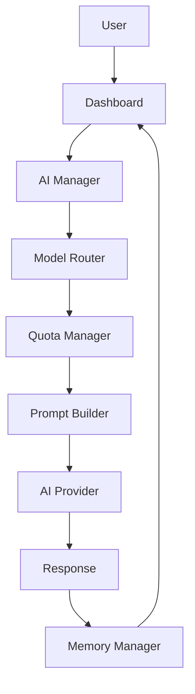
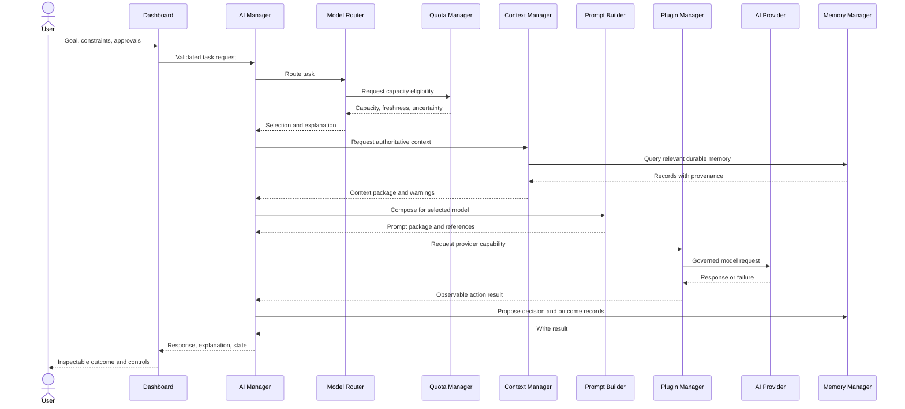

# Data Flow

## Status

Conceptual data flow. Arrows describe how information progresses through a user
operation; they do not define APIs, synchronous calls, process boundaries, or
deployment topology.

## Primary User-to-Response Flow

The linear view emphasizes the user-visible lifecycle:

1. **User → Dashboard:** the user provides a goal, constraints, preferences, and
   approval boundaries.
2. **Dashboard → AI Manager:** the Dashboard sends validated intent to the
   authoritative application boundary.
3. **AI Manager → Model Router:** AI Manager requests an explainable model
   decision for the task.
4. **Model Router → Quota Manager:** the Router requests current capacity
   eligibility and uncertainty before selecting a model.
5. **Quota Manager → Prompt Builder:** quota eligibility is part of the
   coordinated decision context that allows prompt composition to proceed for
   the selected model. AI Manager may mediate this handoff.
6. **Prompt Builder → AI Provider:** an approved, model-ready prompt and context
   package is sent through the relevant integration boundary.
7. **AI Provider → Response:** the provider returns output or an explicit
   failure.
8. **Response → Memory Manager:** policy determines which provenance, decision,
   action, and outcome records should be retained.
9. **Memory Manager → Dashboard:** the user sees the response together with
   manager-owned history, explanation, and retained context.

## Coordination Detail

The primary flow is not a direct dependency graph. The contract-accurate
coordination loop is:

Workflow Engine may govern the same interactions when the request belongs to a
multi-step workflow. Its state transitions and approval gates surround the
component calls rather than replacing their contracts.

## Data Categories

| Category | Origin | Primary consumers | Required properties |
| --- | --- | --- | --- |
| User intent | User through Dashboard | AI Manager, Workflow Engine | validated, attributable, bounded |
| Task requirements | AI Manager | Model Router, Context Manager | explicit, versioned where durable |
| Quota snapshot | Quota Manager | Model Router, Dashboard | source, freshness, uncertainty |
| Routing decision | Model Router | AI Manager, Prompt Builder, Dashboard | candidates, constraints, explanation |
| Context package | Context Manager | Prompt Builder, Workflow Engine | provenance, authority, omissions |
| Prompt package | Prompt Builder | Provider integration | prompt version, context references |
| Provider response | AI Provider through Plugin Manager | AI Manager, Workflow Engine | provider provenance, success or failure |
| Memory record | Memory Manager | Context Manager, Dashboard | scope, authority, provenance, lifecycle |

## Failure Flow

Any stage may return an explicit failure instead of forwarding incomplete or
invented data. AI Manager correlates the failure and exposes it to the
Dashboard. Retry, fallback, approval, or cancellation occurs only under
documented policy.

Examples:

- unknown quota produces an uncertain or no-route result;
- no eligible model stops prompt composition;
- missing authoritative context blocks prompt construction;
- provider failure remains a provider failure and may activate documented
  fallback;
- memory-write failure does not rewrite the provider response, but it is shown
  as an incomplete retention outcome.

## Related Documents

- [System Overview](SYSTEM_OVERVIEW.md)
- [Component Contracts](COMPONENT_CONTRACTS.md)
- [System Boundaries](SYSTEM_BOUNDARIES.md)
- [Glossary](GLOSSARY.md)
