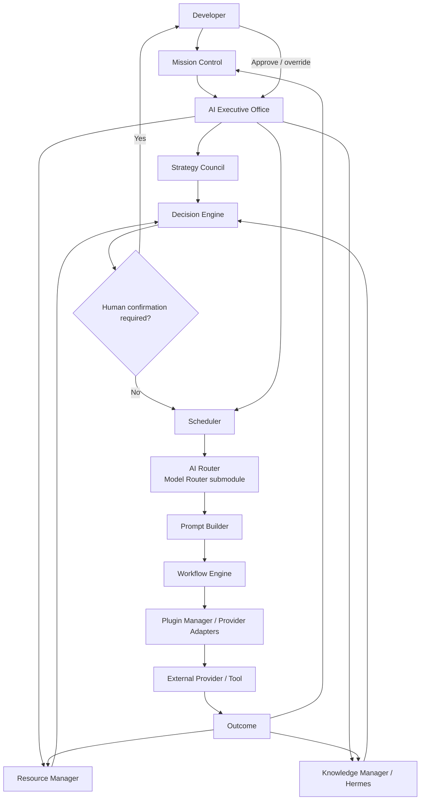
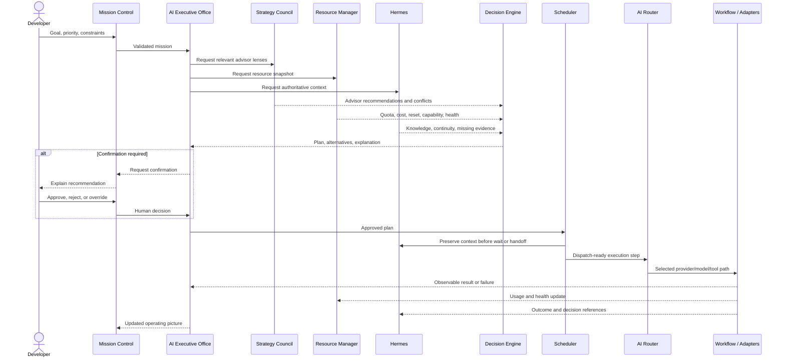

# Data Flow

## Status

Conceptual AI Executive Office flow. Arrows describe information and authority,
not APIs, process boundaries, or deployment topology.

## Strategy-to-Execution Flow

## Decision Detail

## Data Categories

| Category | Authority | Consumers | Required properties |
| --- | --- | --- | --- |
| Goal and priority | Developer | Office, advisors, Decision Engine | attributable, bounded, current |
| Advisor recommendation | Strategy Council role | Decision Engine, Mission Control | lens, evidence, confidence, alternatives |
| Resource snapshot | Resource Manager | Decision Engine, Scheduler, AI Router | source, scope, freshness, uncertainty |
| Knowledge package | Hermes | Advisors, Decision Engine, Execution | provenance, authority, omissions, access |
| Decision record | Decision Engine plus human action | Office, Scheduler, audit | conflicts, weights, rationale, override |
| Schedule | Scheduler | Mission Control, Execution | dependency, wake, resource, approval |
| Route | AI Router | Workflow, adapters, audit | provider, surface, model, fallback, reason |
| Execution result | External system through adapters | Office, Resource, Hermes | provenance, success/failure, usage, artifacts |

## Failure Flow

- Missing advisor evidence can trigger clarification or waiting.
- Unknown resource facts cannot become eligible silently.
- Knowledge conflict blocks or qualifies the recommendation.
- Human rejection returns the decision for revision.
- Missed wake or reservation conflict remains visible in Mission Control.
- No eligible route returns a safe no-route outcome.
- Provider failure updates resource health and can trigger governed replanning.
- Knowledge-write failure does not erase the execution outcome.

## Related Documents

- [System Overview](SYSTEM_OVERVIEW.md)
- [Strategy Council](STRATEGY_COUNCIL.md)
- [Decision Governance](DECISION_GOVERNANCE.md)
- [Component Contracts](COMPONENT_CONTRACTS.md)
- [AI Executive Office](../product/AI_EXECUTIVE_OFFICE.md)
