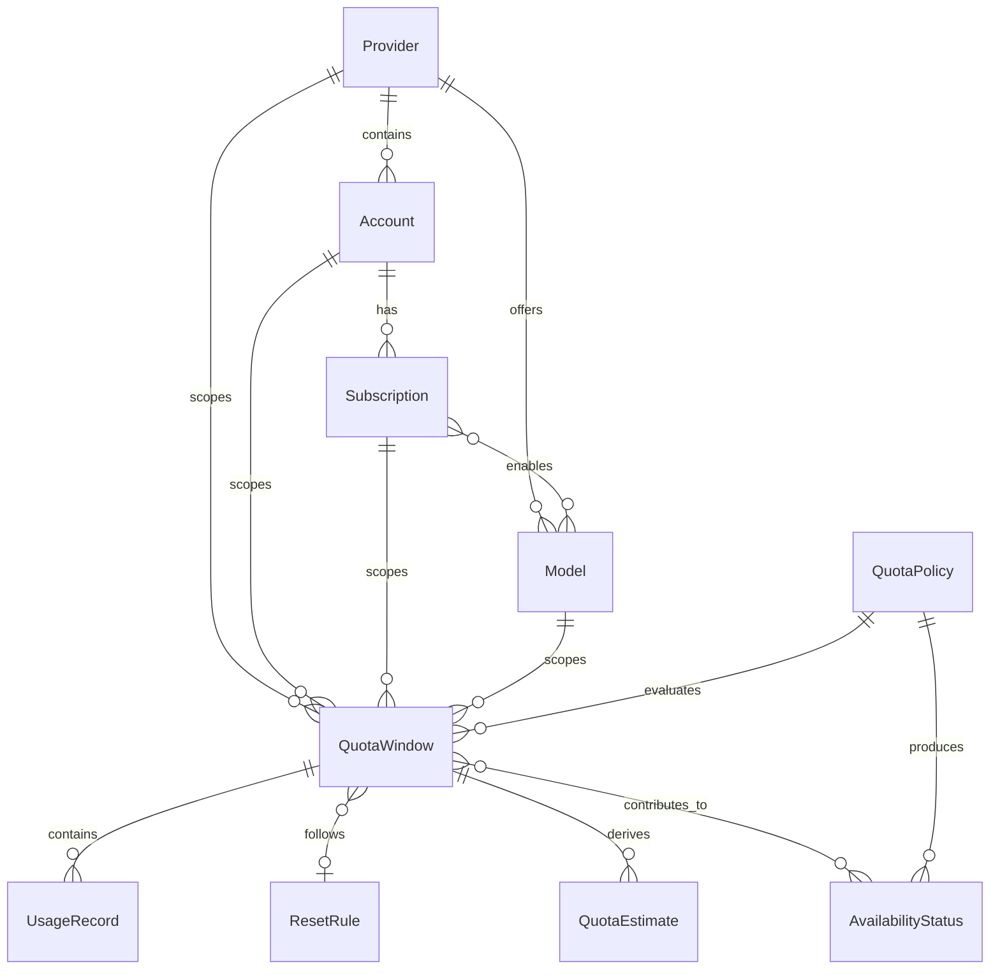

# Quota Data Model

## Status

Conceptual data model for N1. This document defines domain entities and
relationships, not database tables, fields, keys, indexes, or storage choices.

## Modeling Rules

- Identity and scope are explicit.
- Source, freshness, confidence, and provenance travel with quota facts.
- Observations are retained separately from derived current status.
- Provider-specific dimensions remain visible unless normalization is valid.
- Secrets and provider credentials are not domain entities in this model.

## Provider

### Purpose

Identify an external or local source of model capacity.

### Key Fields

- provider identifier and display name;
- provider type: subscription, API, local, or hybrid;
- enabled state;
- capability and source references;
- non-secret metadata.

### Relationships

- has many Models;
- has many Accounts;
- may supply observations through Plugin Manager.

### Notes

Provider identity does not imply one account, plan, quota, or status.

## Model

### Purpose

Identify a model capability to which quota or availability may apply.

### Key Fields

- model identifier;
- Provider reference;
- provider-native model reference;
- display name;
- enabled state;
- capability metadata reference.

### Relationships

- belongs to one Provider;
- may participate in many QuotaWindows;
- may be available through multiple Accounts or Subscriptions.

### Notes

Model metadata is not a quality ranking. Model Router owns selection.

## Account

### Purpose

Represent a user-controlled provider account or local capacity scope without
storing its credentials.

### Key Fields

- account identifier;
- Provider reference;
- user-defined label or masked external reference;
- enabled state;
- account type;
- privacy classification.

### Relationships

- belongs to one Provider;
- may have many Subscriptions;
- may expose many Models;
- owns or scopes QuotaWindows and UsageRecords.

### Notes

Credentials, cookies, and browser sessions are explicitly excluded.

## Subscription

### Purpose

Represent a plan or entitlement associated with an Account.

### Key Fields

- subscription identifier;
- Account reference;
- user-defined plan label;
- active period when known;
- enabled state;
- entitlement notes and provenance.

### Relationships

- belongs to one Account;
- may cover many Models;
- may define or scope many QuotaWindows;
- may reference a QuotaPolicy.

### Notes

A Subscription proves neither current availability nor a numeric allowance.

## QuotaPolicy

### Purpose

Define how observations become warnings, restrictions, statuses, and scheduling
eligibility.

### Key Fields

- policy identifier and version;
- applicable scope;
- freshness limits;
- warning and critical thresholds;
- aggregation and precedence rules;
- reservation and override rules;
- enabled state.

### Relationships

- applies to Provider, Account, Subscription, Model, or QuotaWindow scopes;
- evaluates UsageRecords, QuotaEstimates, and ResetRules;
- produces AvailabilityStatus decisions.

### Notes

Policy changes are versioned and trigger reevaluation.

## QuotaWindow

### Purpose

Represent one independently limiting capacity dimension over a defined or
unknown window.

### Key Fields

- window identifier;
- scope references;
- dimension and unit;
- limit, used, and remaining values when known;
- window start and end when known;
- ResetRule reference;
- source, observed time, freshness, and confidence;
- current enabled state.

### Relationships

- applies to a Provider, Account, Subscription, Model, or combination;
- contains or is affected by UsageRecords;
- may use one ResetRule;
- may have QuotaEstimates;
- contributes to AvailabilityStatus.

### Notes

Rate, spend, token, message, concurrency, and qualitative limits remain separate
windows unless a valid policy combines them.

## UsageRecord

### Purpose

Record a consumption fact or user assertion that affects a QuotaWindow.

### Key Fields

- usage record identifier;
- QuotaWindow reference;
- amount and unit;
- occurred and recorded time;
- source type and provenance;
- correlation reference;
- validation status.

### Relationships

- belongs to one primary QuotaWindow;
- may reference a task, provider action, or manual entry;
- contributes to current usage and estimates.

### Notes

UsageRecord is append-oriented history. Corrections supersede records rather
than silently rewriting provenance.

## ResetRule

### Purpose

Describe how a QuotaWindow is expected to renew or release capacity.

### Key Fields

- reset rule identifier;
- rule type: fixed, calendar, rolling, one-time, provider-signaled, or unknown;
- interval or schedule where applicable;
- timezone or offset;
- next expected reset when known;
- source, confidence, and last evaluation.

### Relationships

- may govern many compatible QuotaWindows;
- produces reset events and next-reset calculations.

### Notes

The rule and next calculated reset are distinct. Reaching a reset triggers
reevaluation rather than unconditional availability.

## QuotaEstimate

### Purpose

Represent derived quota information when confirmed data is incomplete.

### Key Fields

- estimate identifier;
- target QuotaWindow;
- estimated value and unit;
- method and input references;
- confidence and uncertainty;
- calculated time;
- expiration or invalidation condition;
- active or invalidated state.

### Relationships

- belongs to a QuotaWindow;
- derives from UsageRecords, prior observations, or reset assumptions;
- may contribute to AvailabilityStatus only under policy.

### Notes

Estimates never overwrite source facts and remain visibly estimated.

## AvailabilityStatus

### Purpose

Represent the current scheduling interpretation for a defined scope.

### Key Fields

- status identifier;
- target scope;
- value: `available`, `warning`, `limited`, `exhausted`, `cooling_down`,
  `unknown`, or `disabled`;
- reason and explanation;
- effective and evaluated time;
- source basis references;
- freshness and confidence;
- reset or cooldown time where applicable;
- QuotaPolicy version;
- superseded status reference.

### Relationships

- derives from applicable QuotaWindows, QuotaPolicy, provider/account state,
  cooldown, and manual overrides;
- may be consumed by Dashboard and Model Router;
- changes emit status events.

### Notes

AvailabilityStatus is a derived interpretation, not the source observation.
History is retained for explainability.

## Relationship Overview

The diagram is conceptual. Cardinality may be refined when provider research
validates real quota structures.

## Related Documents

- [Quota Manager Specification](QUOTA_MANAGER_SPEC.md)
- [Quota State Machine](QUOTA_STATE_MACHINE.md)
- [Quota Manager Research](../research/QUOTA_MANAGER.md)
