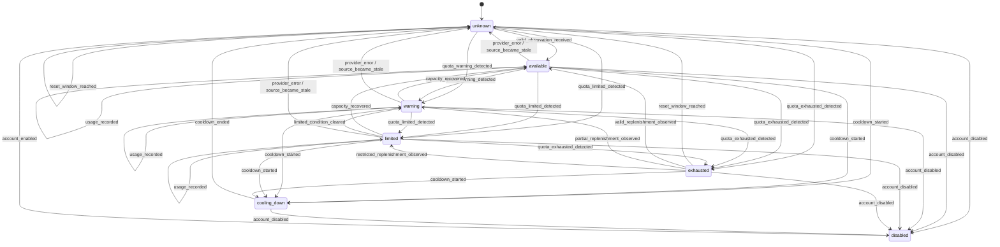

# Quota State Machine

## Status

Conceptual state machine for AvailabilityStatus. It defines observable
transitions and reevaluation behavior, not implementation code.

## States

| State | Meaning |
| --- | --- |
| `unknown` | Current trustworthy availability cannot be established. |
| `available` | Capacity is usable above warning thresholds. |
| `warning` | Capacity remains usable but a warning threshold is active. |
| `limited` | Capacity or policy permits only restricted demand. |
| `exhausted` | Known usable capacity is depleted. |
| `cooling_down` | Temporary backoff prevents scheduling. |
| `disabled` | User or policy has excluded the scope. |

## State Diagram

## Transition Events

### `usage_recorded`

Reevaluates all applicable windows. It may remain in the current state or emit
`quota_warning_detected`, `quota_limited_detected`, or
`quota_exhausted_detected`.

### `quota_warning_detected`

Transitions an eligible non-disabled scope to `warning` when warning policy is
true and no more restrictive state applies.

### `quota_limited_detected`

Transitions to `limited` when critical remaining capacity or policy restricts
the demand that can be scheduled.

### `quota_exhausted_detected`

Transitions to `exhausted` only from trustworthy evidence that an applicable
hard limit is depleted. Source failure alone cannot emit this event.

### `reset_window_reached`

Transitions `exhausted` to `unknown` and triggers reevaluation. A timer does not
prove capacity was restored.

### `manual_override_applied`

Reevaluates any non-disabled state using the override's explicit target status,
scope, reason, actor, and expiration. An override can transition to
`available`, `warning`, `limited`, `exhausted`, `cooling_down`, `unknown`, or
`disabled`, subject to policy.

### `provider_error`

Records source failure. It transitions to `unknown` only when no still-fresh,
policy-acceptable observation remains. It never directly means `exhausted`.

### `account_disabled`

Transitions any state to `disabled`. Existing history remains inspectable, but
the scope is not schedulable.

### `account_enabled`

Transitions `disabled` to `unknown`, then requires fresh reevaluation. Enabling
an account does not prove available capacity.

### `cooldown_started`

Transitions any enabled state to `cooling_down` with reason and expected end
when known.

### `cooldown_ended`

Transitions `cooling_down` to `unknown` and requires reevaluation.

### `source_became_stale`

Transitions to `unknown` when the effective status no longer has a sufficiently
fresh basis.

## Manual Override Rules

- Override is not a hidden transition.
- It records actor, reason, scope, applied time, and expiration.
- It does not alter the provenance of underlying observations.
- Expiration emits `manual_override_expired` and reevaluates from current facts.
- An account-level disabled policy takes precedence unless the same authority
  explicitly re-enables it.

## Transition Invariants

- Every transition records previous state, next state, event, reason, effective
  time, and policy version.
- `unknown` is the safe fallback when trustworthy evidence is insufficient.
- `disabled` and active `cooling_down` are not schedulable.
- Reset and cooldown timers trigger reevaluation, not assumed availability.
- Failed or malformed observations do not overwrite the last valid observation.
- Status history remains available for explanation.

## Related Documents

- [Quota Manager Specification](QUOTA_MANAGER_SPEC.md)
- [Quota Data Model](QUOTA_DATA_MODEL.md)
- [Quota Manager MVP](../product/QUOTA_MANAGER_MVP.md)
