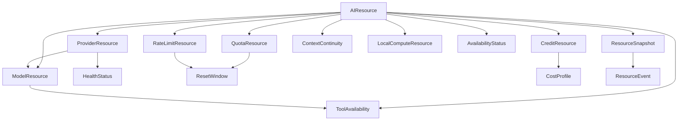

# Resource Data Model

## Status

Conceptual data model. Entities describe meaning and relationships, not tables,
documents, API payloads, storage engines, or implementation schemas.

## Modeling Rules

- Identity, observation, policy, and derived state remain distinguishable.
- Every dynamic fact has scope, source, observation time, and freshness.
- Confirmed, calculated, estimated, and manual values are not interchangeable.
- Provider-native units and semantics are retained.
- A snapshot is immutable; newer facts supersede rather than rewrite it.
- `unknown` is valid data, not permission to assume availability.

## Entity Relationship Overview

## AIResource

### Purpose

Provide the common identity and lifecycle envelope for any managed resource.

### Key Fields

- resource identifier and resource type;
- scope: provider, model, account, project, task, or local runtime;
- source and authority;
- observed, effective, and expiry times;
- freshness and confidence;
- enabled state and policy references;
- related availability and health status.

### Relationships

Parent abstraction for all resource entities; included in snapshots and changed
by resource events.

### Notes

The common envelope does not erase type-specific units or semantics.

## ProviderResource

### Purpose

Represent dynamic resources and constraints associated with a Provider Registry
entry and, when applicable, an account or access surface.

### Key Fields

- provider registry reference;
- account and surface scope;
- authentication-state reference without secrets;
- service availability and adapter health;
- supported access modes;
- jurisdiction or policy constraints.

### Relationships

Contains or references ModelResource, quota, credits, rate limits, health, and
tool observations.

### Notes

Stable provider identity belongs to Provider Registry. This entity owns only
dynamic, scoped resource state.

## ModelResource

### Purpose

Represent the current usable state of a Model Catalog entry for a provider,
account, surface, or local runtime.

### Key Fields

- model catalog reference;
- provider and account scope;
- current availability;
- capability-version reference;
- cost-profile reference;
- context and tool constraints;
- observed model alias or version.

### Relationships

Belongs to a ProviderResource or LocalComputeResource and may reference
ToolAvailability, ContextContinuity, and CostProfile.

### Notes

It does not duplicate durable capability definitions from Model Catalog.

## QuotaResource

### Purpose

Represent an allowance, usage limit, or estimated remaining capacity over a
defined scope and window.

### Key Fields

- quota-policy reference;
- provider, model, account, and subscription scope;
- allowance, consumed, remaining, and units;
- observation type and confidence;
- warning thresholds;
- current quota state.

### Relationships

References ResetWindow and may constrain ProviderResource or ModelResource.

### Notes

Multiple daily, weekly, rolling, or feature-specific quotas may coexist.
Quota-specific semantics remain defined by the existing quota documents.

## CreditResource

### Purpose

Represent prepaid, promotional, contractual, or manually tracked credits.

### Key Fields

- balance and native unit;
- provider and billing-account scope;
- source and confirmation type;
- expiration;
- applicable services or models;
- reserved or committed amount.

### Relationships

References CostProfile and constrains provider or model usage.

### Notes

Credits are not assumed to equal currency or quota.

## RateLimitResource

### Purpose

Represent request, token, concurrency, or provider-specific throughput limits.

### Key Fields

- limit dimension and native unit;
- maximum, observed usage, and remaining capacity;
- fixed, rolling, or provider-controlled window;
- retry or recovery hint;
- burst and sustained constraints;
- current status.

### Relationships

References ResetWindow and constrains ProviderResource, ModelResource, or tool
execution.

### Notes

Rate limits remain separate from subscription quota and provider health.

## ResetWindow

### Purpose

Describe when and how a quota, rate limit, cooldown, credit, or policy window
changes.

### Key Fields

- window identifier and type;
- start, expected end, and timezone;
- fixed, rolling, event-based, or unknown rule;
- confirmed or estimated reset time;
- confidence and source;
- last reset observation.

### Relationships

Referenced by QuotaResource and RateLimitResource and can emit reset events.

### Notes

An expected reset is not guaranteed availability. State must be reevaluated
after the window is reached.

## CostProfile

### Purpose

Represent known or estimated economic cost for consuming a resource.

### Key Fields

- provider, model, account, and surface scope;
- native pricing dimensions and currency;
- subscription allocation or marginal API cost;
- fixed, variable, and estimated components;
- effective period and source;
- confidence and budget-policy reference.

### Relationships

Referenced by CreditResource, ModelResource, ResourceSnapshot, and budget
evaluation.

### Notes

Opportunity, waiting, and context-rebuild costs may be expressed qualitatively
when monetary comparison would be misleading.

## AvailabilityStatus

### Purpose

State whether a resource can satisfy a declared demand now.

### Key Fields

- normalized state;
- reason codes;
- evaluated demand;
- blocking and warning constraints;
- effective and reevaluation times;
- source facts and confidence;
- manual override reference.

### Relationships

Derived for any AIResource and included in a ResourceSnapshot.

### Notes

Availability is demand-sensitive. A resource may satisfy a small task while
being limited for a larger one.

## HealthStatus

### Purpose

Represent operational health of a provider, adapter, tool, or local runtime.

### Key Fields

- subject and scope;
- healthy, degraded, unavailable, or unknown condition;
- observed symptoms;
- source and observation time;
- expected recovery or next check;
- incident reference.

### Relationships

May constrain ProviderResource, ToolAvailability, or LocalComputeResource and
contribute to AvailabilityStatus.

### Notes

Health does not imply sufficient quota, credit, capability, or permission.

## ToolAvailability

### Purpose

Represent whether a required tool can be used through a specific execution
path.

### Key Fields

- tool and plugin/adapter reference;
- provider, model, runtime, and project scope;
- permission and approval state;
- health and compatibility;
- version;
- limitation or risk notes.

### Relationships

References ModelResource, ProviderResource, Plugin Manager facts, and
HealthStatus.

### Notes

Installed, enabled, permitted, healthy, and task-eligible are distinct states.

## ContextContinuity

### Purpose

Represent the value and portability of current working context as a managed
resource.

### Key Fields

- context identifier, type, and owner;
- task, PR, project, conversation, and session references;
- completeness, freshness, and authority;
- portability and preservation state;
- rebuild effort and risk;
- Hermes or handoff-package reference.

### Relationships

May attach to ModelResource, task demand, ResourceSnapshot, or a reassignment
option.

### Notes

Context content may be access-controlled. Resource Manager can track metadata
and continuity state without storing all underlying content.

## LocalComputeResource

### Purpose

Represent local execution capacity available to models, tools, or workflows.

### Key Fields

- runtime and host identity;
- processor, accelerator, memory, storage, and concurrency classes;
- current load, queue, and reservation;
- model/runtime compatibility;
- health, privacy, and power constraints;
- availability window.

### Relationships

May host ModelResource, enable ToolAvailability, and reference HealthStatus.

### Notes

The conceptual model avoids prescribing telemetry collection or hardware
technology.

## ResourceSnapshot

### Purpose

Freeze the resource facts used by a decision, schedule, or Mission Control view
at a known point in time.

### Key Fields

- snapshot identifier and version;
- scope and requested task demand;
- creation time and validity horizon;
- included resource/status references;
- exclusions, conflicts, and unknowns;
- policy and catalog versions;
- superseding snapshot reference.

### Relationships

Aggregates AIResource and AvailabilityStatus references and is consumed by
Decision Engine, Scheduler, and Mission Control.

### Notes

Snapshots are immutable and must be reevaluated after expiration or relevant
events.

## ResourceEvent

### Purpose

Record an attributable observation, transition, correction, or policy-relevant
change.

### Key Fields

- event identifier and type;
- subject resource and scope;
- event and recorded times;
- source or actor;
- previous and resulting state;
- reason, evidence, and correlation identifiers;
- related snapshot, decision, schedule, or execution.

### Relationships

Updates current resource projections and links resource history to snapshots
and downstream outcomes.

### Notes

Events are append-only conceptual facts. Corrections supersede prior
interpretations without deleting audit history.

## Related Documents

- [Resource Manager](RESOURCE_MANAGER.md)
- [Resource State Model](RESOURCE_STATE_MODEL.md)
- [Context Continuity](CONTEXT_CONTINUITY.md)
- [Cost and Budget](COST_AND_BUDGET.md)
- [Quota Data Model](QUOTA_DATA_MODEL.md)
- [Provider Registry](../providers/PROVIDERS.md)
- [Model Catalog](../providers/MODEL_CATALOG.md)
