# Resource State Model

## Status

Conceptual state model for normalized resource availability. It does not define
storage, API enums, polling intervals, or provider-specific implementation.

## State Semantics

| State | Meaning |
| --- | --- |
| `available` | Current evidence indicates the declared demand can be satisfied. |
| `warning` | Usable now, but a threshold, reset, cost, health, or continuity risk requires attention. |
| `limited` | Usable only for a reduced demand, constrained path, or restricted period. |
| `exhausted` | A consumable allowance or approved budget has no usable capacity. |
| `cooling_down` | Temporarily blocked until a known or estimated recovery condition. |
| `unavailable` | Confirmed unusable for the demand for a reason other than depletion alone. |
| `degraded` | Usable with impaired health, performance, reliability, capability, or continuity. |
| `unknown` | Evidence is missing, stale, conflicting, or cannot be normalized safely. |
| `disabled` | Explicit policy, account, user, or administrative action prevents use. |

States apply to a declared scope and demand. They are not permanent properties
of a provider or model.

## State Diagram

```mermaid
stateDiagram-v2
    [*] --> unknown

    unknown --> available: resource_observed
    unknown --> warning: threshold_crossed
    unknown --> limited: resource_observed / constrained
    unknown --> degraded: provider_health_changed
    unknown --> unavailable: local_compute_unavailable
    unknown --> disabled: manual_override_applied / disable

    available --> warning: threshold_crossed
    available --> limited: usage_recorded / capacity_reduced
    available --> exhausted: exhausted_detected
    available --> degraded: provider_health_changed
    available --> unavailable: local_compute_unavailable
    available --> disabled: manual_override_applied / disable

    warning --> available: resource_observed / recovered
    warning --> limited: usage_recorded
    warning --> exhausted: exhausted_detected
    warning --> exhausted: cost_limit_reached
    warning --> degraded: provider_health_changed
    warning --> disabled: manual_override_applied / disable

    limited --> available: reset_window_reached / reevaluated
    limited --> warning: resource_observed / partial_recovery
    limited --> exhausted: exhausted_detected
    limited --> cooling_down: usage_recorded / cooldown_started
    limited --> degraded: provider_health_changed
    limited --> unavailable: local_compute_unavailable
    limited --> disabled: manual_override_applied / disable

    exhausted --> cooling_down: resource_observed / recovery_pending
    exhausted --> unknown: reset_window_reached
    exhausted --> available: manual_override_applied / capacity_confirmed
    exhausted --> disabled: manual_override_applied / disable

    cooling_down --> unknown: reset_window_reached
    cooling_down --> available: resource_observed / recovered
    cooling_down --> unavailable: provider_health_changed
    cooling_down --> disabled: manual_override_applied / disable

    degraded --> available: provider_health_changed / recovered
    degraded --> warning: threshold_crossed
    degraded --> limited: resource_observed / constrained
    degraded --> unavailable: provider_health_changed / outage
    degraded --> disabled: manual_override_applied / disable

    unavailable --> unknown: resource_observed / recheck
    unavailable --> degraded: provider_health_changed / partial_recovery
    unavailable --> available: resource_observed / recovered
    unavailable --> disabled: manual_override_applied / disable

    disabled --> unknown: manual_override_applied / enable

    available --> available: context_owner_changed / continuity_preserved
    available --> warning: context_owner_changed / continuity_at_risk
    warning --> limited: context_owner_changed / rebuild_required
```

## Event Semantics

### `resource_observed`

Adds a manual, provider, adapter, local, or calculated observation. The event
can establish, confirm, degrade, or invalidate state based on freshness,
confidence, scope, and declared demand.

### `usage_recorded`

Records consumption or a throughput event. It can cross thresholds, reduce
eligibility, exhaust capacity, or start a cooldown. A usage record alone does
not imply confirmed remaining capacity.

### `threshold_crossed`

Signals a warning, scarcity, cost, health, or continuity threshold. The applied
policy and threshold version must be recorded.

### `exhausted_detected`

Confirms that a consumable resource cannot satisfy further eligible demand. It
must identify the exhausted quota, credit, budget, or other capacity.

### `reset_window_reached`

Signals that a predicted or confirmed reset boundary has arrived. The state
moves to `unknown` until a new observation confirms availability unless the
reset itself is authoritative.

### `provider_health_changed`

Changes provider, surface, adapter, or model health. It may cause `degraded` or
`unavailable` without changing quota or credits.

### `manual_override_applied`

Applies a human-attributed, reasoned, and optionally expiring status or policy
override. Enablement returns to `unknown` until fresh evidence is evaluated.

### `context_owner_changed`

Records a handoff between model, agent, session, person, or Hermes package. It
can preserve availability, raise continuity risk, or make the resource limited
while context is rebuilt.

### `cost_limit_reached`

Confirms that an applicable cost ceiling or budget policy prevents more
consumption. It must identify the scope, currency or policy unit, and reset or
approval condition.

### `local_compute_unavailable`

Reports that a required local runtime or capacity cannot serve demand. It
affects only dependent resources and must not mark unrelated provider resources
unavailable.

## Transition Rules

- A transition is evaluated per resource, scope, and declared demand.
- `unknown` does not automatically become `available`.
- Time passing can trigger reevaluation but does not prove recovery.
- `disabled` requires explicit enablement; provider recovery cannot override it.
- Manual overrides retain actor, reason, priority, and expiration.
- Conflicting authoritative observations result in `unknown` until resolved.
- Composite availability uses the most restrictive required dependency while
  preserving every contributing state.
- Context, cost, and local compute can constrain availability without rewriting
  quota state.

## Related Documents

- [Resource Manager](RESOURCE_MANAGER.md)
- [Resource Data Model](RESOURCE_DATA_MODEL.md)
- [Quota State Machine](QUOTA_STATE_MACHINE.md)
- [Context Continuity](CONTEXT_CONTINUITY.md)
- [Cost and Budget](COST_AND_BUDGET.md)
