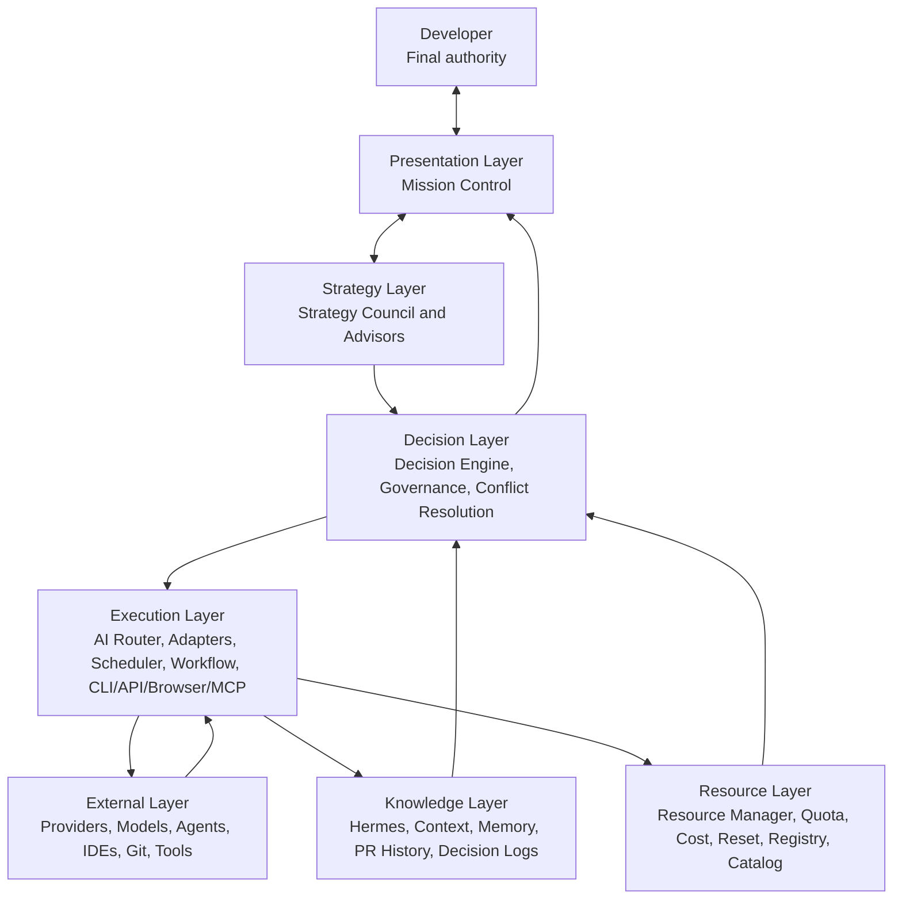

# System Overview

## Status

Conceptual architecture for the AI Executive Office. It defines authority,
layers, and information flow without selecting frameworks, protocols, storage,
process boundaries, or deployment topology.

## System Purpose

ai-manager helps developers continuously ship software by coordinating AI
advisors, AI resources, project knowledge, governed decisions, scheduling, and
execution workflows.

It is an AI Executive Office and emerging AI Operating System around external
models, agents, developer tools, and providers. It does not replace those
systems or the developer's authority.

## Architecture Layers

Arrows show conceptual information and authority flow, not direct API calls.

## Presentation Layer

### Includes

- Mission Control Dashboard;
- future approved presentation clients.

### Responsibilities

- collect developer goals, priorities, constraints, and confirmations;
- present the operating picture across strategy, resources, knowledge, and
  execution;
- show advisor recommendations, conflicts, uncertainty, and explanations;
- expose wait, reassign, split, preserve-context, approve, reject, override,
  pause, retry, and cancel controls;
- keep stale or incomplete state visible.

### Boundary

Presentation does not own policy, decide recommendations, or call external
providers directly.

## Strategy Layer

### Includes

- Strategy Council;
- Architecture Advisor;
- Resource Advisor / AI Chief of Staff;
- Knowledge Advisor / Hermes;
- Cost Advisor;
- Risk Advisor;
- Execution Advisor.

### Responsibilities

- analyze goals through specialized lenses;
- identify constraints, options, risks, missing evidence, and tradeoffs;
- produce structured, sourced recommendations;
- make disagreement explicit;
- abstain when evidence is insufficient.

### Boundary

Advisors recommend. They do not dispatch tools, allocate resources, alter policy,
or execute work.

## Decision Layer

### Includes

- Decision Engine;
- Decision Governance;
- Conflict Resolution;
- decision records and human override rules.

### Responsibilities

- align recommendations with developer goals;
- validate advisor inputs and evidence;
- separate hard constraints from preferences;
- apply weights, vetoes, policy, and resource facts;
- reconcile architecture, resources, knowledge, cost, risk, and execution;
- recommend acting, waiting, reassigning, splitting, or preserving context;
- construct an explainable execution plan;
- request human confirmation when required;
- preserve the audit trail.

### Boundary

Decision Engine proposes and governs. It does not perform provider execution.
Human authority remains final.

## Resource Layer

### Includes

- Provider Registry;
- Model Catalog;
- Resource Manager as the primary Resource Layer component;
- Quota Manager as a Resource Manager sub-capability;
- quota, API credits, daily and weekly limits;
- rate limits, reset time, and cooldown;
- cost profiles, budgets, and reservations;
- availability and provider health;
- model capability and tool availability;
- context continuity;
- local compute.

### Responsibilities

- maintain the current inventory of AI resources;
- normalize availability without erasing provider provenance;
- distinguish confirmed, manual, estimated, stale, and unknown facts;
- expose scarce-resource and opportunity-cost constraints;
- treat context continuity, cost, and local compute as first-class resources;
- support scheduling, preservation, and eligibility;
- update resource state from execution outcomes.

### Boundary

Resource Layer reports resources and constraints. It does not choose the final
plan or execute providers. Resource Manager owns composed resource state;
Quota Manager owns quota-specific normalization beneath it; Provider Registry
and Model Catalog retain identity and capability authority.

## Knowledge Layer

### Includes

- Knowledge Manager / Hermes;
- Context Manager behavior;
- Memory Manager behavior;
- product and architecture specifications;
- ADRs, PR history, workflow outcomes, and decision logs.

### Responsibilities

- find authoritative project knowledge;
- assemble context with provenance, freshness, and authority;
- preserve continuity across models, advisors, sessions, and projects;
- identify conflicts and missing information;
- retain durable memory without overriding documentation;
- prepare context-preservation packages for wait, reassignment, or task split.

### Boundary

Knowledge Layer informs decisions and execution. It does not invent product
intent or treat model-generated memory as authoritative.

## Execution Layer

### Includes

- Scheduler;
- Workflow Engine;
- AI Router, with Model Router as a submodule;
- Prompt Builder;
- Provider Adapters;
- Plugin Manager;
- CLI, API, browser, MCP, IDE, Git, and tool integration boundaries.

### Responsibilities

- sequence approved work;
- wait for time, resource, or approval conditions;
- preserve context before reassignment;
- route approved execution steps to eligible providers/models/tools;
- build model-ready prompt and context packages;
- enforce workflow state, permissions, approvals, retries, and cancellation;
- return observable results, failures, usage, and artifacts.

### Boundary

Execution cannot redefine the goal, advisor recommendation, governance policy,
or approved plan. AI Router selects an execution path inside the plan; it is not
the product's decision core.

## External Layer

### Includes

- OpenAI;
- Anthropic;
- Google;
- OpenRouter;
- Ollama and other local runtimes;
- Codex;
- Claude Code;
- Gemini CLI or successor products;
- OpenHands;
- IDEs, Git, MCP servers, and other approved tools.

### Responsibilities

External systems own their native models, interfaces, availability, billing,
errors, safety behavior, and terms.

### Boundary

ai-manager integrates with external systems but does not absorb their native
scope, bypass their controls, or grant them authority over manager policy,
knowledge, or decisions.

## End-to-End Operating Flow

1. **Developer** defines the goal, priority, constraints, and approval boundary
   through Mission Control.
2. **AI Executive Office** establishes the current operating picture.
3. **Strategy Council** requests the relevant advisor lenses.
4. **Resource Manager** supplies quota, credits, cost, reset, health, capability,
   context-capacity, and tool facts.
5. **Hermes** supplies authoritative project knowledge and continuity risks.
6. **Decision Engine** reconciles advisor input, resources, knowledge, policy,
   and deadline.
7. The system recommends act, wait, reassign, split, preserve context, or request
   clarification.
8. **Developer** confirms, rejects, or overrides when required.
9. **Scheduler** sequences the approved plan.
10. **AI Router** selects an eligible execution path; Model Router may rank
    candidate models within that path.
11. **Provider Adapters and tools** execute through governed boundaries.
12. Outcomes update Resource Manager, Hermes, decision logs, and Mission Control.

## Authority Model

| Authority | Owns |
| --- | --- |
| Developer | goals, priorities, approvals, architecture tradeoffs, accepted risk, final decision |
| AI Executive Office | coordination and operating picture |
| Advisors | specialized recommendations |
| Decision Engine | aggregation, policy application, explanation, proposed plan |
| Resource Manager | resource facts and scheduling constraints |
| Hermes | knowledge provenance and continuity |
| Scheduler | approved sequence and wake conditions |
| AI Router | approved execution-path selection |
| External systems | native execution and provider facts |

No lower authority silently redefines a higher one.

## Cross-Cutting Requirements

### Documentation First

Product, architecture, advisor, resource, governance, and execution behavior is
specified before implementation.

### Explainability

Every recommendation explains advisor input, resource facts, policy, conflicts,
alternatives, and human action.

### Observability

Every state transition, recommendation, override, dispatch, external action, and
outcome is correlated.

### Human Control

Consequential decisions and actions preserve an inspectable confirmation,
rejection, pause, and override path.

### Context Continuity

Wait, reassign, split, compression, and session changes preserve sourced
context.

### Provider Neutrality

External terms remain explicit at adapter boundaries. Registry facts do not
become provider favoritism.

## Out of Scope for This Version

This conceptual architecture does not define:

- implementation language or framework;
- concrete APIs or schemas;
- database or storage technology;
- process or service topology;
- UI layout;
- provider adapter implementation;
- autonomous authority expansion;
- enterprise identity or billing implementation.

## Related Documents

- [AI Executive Office](../product/AI_EXECUTIVE_OFFICE.md)
- [Strategy Council](STRATEGY_COUNCIL.md)
- [Advisor Model](ADVISOR_MODEL.md)
- [Decision Governance](DECISION_GOVERNANCE.md)
- [Conflict Resolution](CONFLICT_RESOLUTION.md)
- [Resource Manager](RESOURCE_MANAGER.md)
- [Resource Data Model](RESOURCE_DATA_MODEL.md)
- [Resource State Model](RESOURCE_STATE_MODEL.md)
- [Context Continuity](CONTEXT_CONTINUITY.md)
- [Cost and Budget](COST_AND_BUDGET.md)
- [Component Contracts](COMPONENT_CONTRACTS.md)
- [System Boundaries](SYSTEM_BOUNDARIES.md)
- [Provider Registry](../providers/PROVIDERS.md)
- [Roadmap](../roadmap/ROADMAP.md)
