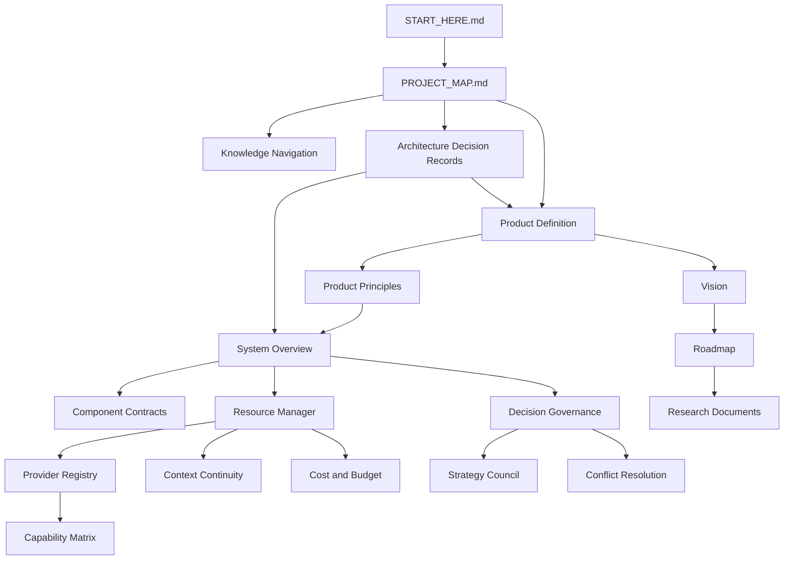

# Knowledge Navigation

ai-manager treats the repository as a knowledge base, not just a source-code
container. The documents are designed to preserve product intent, architecture
authority, decision history, resource models, provider facts, and roadmap order
for both humans and AI agents.

## Repository as Knowledge Base

The repository must answer three questions before implementation begins:

1. What are we building?
2. Why is this the right shape?
3. Which document is authoritative when there is a conflict?

This makes the repository usable by an AI agent that has no prior conversation
history. The agent should be able to read the documents, identify the correct
source of truth, and continue safely without inventing missing product intent.

## Documentation First and Knowledge First

Documentation First means product and architecture decisions are written before
implementation.

Knowledge First extends that rule: documents must also be navigable,
relationship-aware, and explicit about authority. A document is not useful just
because it exists. It must be connected to the rest of the knowledge base and
clear about whether it is a source of truth, supporting research, or historical
decision record.

## Document Layers

| Layer | Purpose | Examples |
| --- | --- | --- |
| Entry | Fast orientation and repository navigation. | [START_HERE.md](../../START_HERE.md), [README.md](../../README.md), [PROJECT_MAP.md](../../PROJECT_MAP.md) |
| Product | Defines what ai-manager is and is not. | [PRODUCT.md](../product/PRODUCT.md), [AI_EXECUTIVE_OFFICE.md](../product/AI_EXECUTIVE_OFFICE.md), [VISION.md](../product/VISION.md) |
| Principles | Defines durable product rules. | [PRINCIPLES.md](../product/PRINCIPLES.md) |
| Architecture | Defines layers, boundaries, components, and contracts. | [SYSTEM_OVERVIEW.md](../architecture/SYSTEM_OVERVIEW.md), [COMPONENT_CONTRACTS.md](../architecture/COMPONENT_CONTRACTS.md) |
| Resource | Defines Resource Manager, quota, cost, context, and availability. | [RESOURCE_MANAGER.md](../architecture/RESOURCE_MANAGER.md), [CONTEXT_CONTINUITY.md](../architecture/CONTEXT_CONTINUITY.md) |
| Decision | Defines governance, advisors, and conflict resolution. | [STRATEGY_COUNCIL.md](../architecture/STRATEGY_COUNCIL.md), [DECISION_GOVERNANCE.md](../architecture/DECISION_GOVERNANCE.md) |
| Provider | Defines provider registry and capability facts. | [PROVIDERS.md](../providers/PROVIDERS.md), [CAPABILITY_MATRIX.md](../providers/CAPABILITY_MATRIX.md) |
| Roadmap | Defines capability order and exit criteria. | [ROADMAP.md](../roadmap/ROADMAP.md) |
| ADR | Records accepted decisions and their consequences. | [ADR-0001](../decisions/ADR-0001-documentation-first.md) |

## Relationship Graph

## Avoiding Document Drift

Document drift happens when two files describe the same topic differently, or
when implementation changes behavior without updating the authoritative
specification.

To avoid drift:

- identify the source-of-truth document before editing;
- update supporting documents in the same PR when authority changes;
- update [PROJECT_MAP.md](../../PROJECT_MAP.md) when adding, renaming, or
  changing document authority;
- update [SOURCE_OF_TRUTH.md](SOURCE_OF_TRUTH.md) when a topic gains a new
  authoritative document;
- keep research documents clearly labeled as research when they are not
  normative;
- use ADRs for accepted cross-cutting decisions.

## Source-of-Truth Documents

The primary source-of-truth index is
[SOURCE_OF_TRUTH.md](SOURCE_OF_TRUTH.md).

At a high level:

- product positioning is governed by product documents;
- principles are governed by [PRINCIPLES.md](../product/PRINCIPLES.md);
- architecture layers and component contracts are governed by architecture
  documents;
- Resource Manager is governed by resource architecture documents;
- providers are governed by provider registry documents;
- roadmap order is governed by [ROADMAP.md](../roadmap/ROADMAP.md);
- accepted cross-cutting decisions are governed by ADRs.

## Research and Supporting Documents

Research documents are useful context, but they do not override accepted product
or architecture specifications. When a research conclusion becomes accepted
product behavior, it must be promoted into the relevant source-of-truth
document or recorded in an ADR.

Supporting documents include:

- research notes;
- MVP boundary documents;
- capability matrices;
- selection guides;
- data-flow diagrams;
- glossaries.

Supporting documents help explain and implement decisions, but they should not
silently redefine the source of truth.
