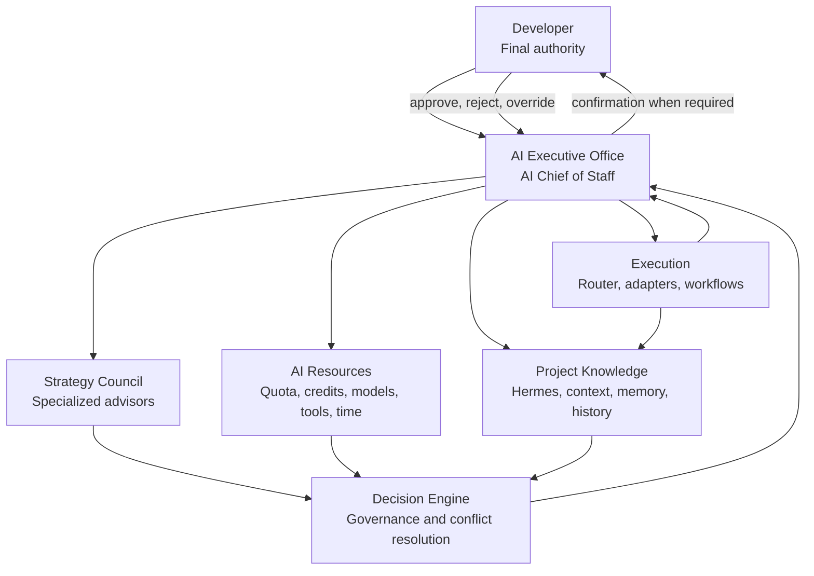

# AI Executive Office

## Status

Draft product-positioning specification. This document governs how ai-manager is
described and how later product and architecture decisions are evaluated.

## Core Positioning

> **AI Manager is an AI Executive Office that helps developers continuously
> ship software by coordinating AI advisors, AI resources, project knowledge,
> and execution workflows.**

ai-manager is also an emerging **AI Operating System** for AI-assisted software
development: a persistent coordination layer that keeps strategy, resources,
knowledge, decisions, and execution aligned across providers, tools, sessions,
and projects.

## Why the Product Is Being Repositioned

The earlier product framing centered on quota visibility and explainable model
routing. Those remain valuable, but they describe only one decision inside a
larger development system.

A developer does not merely need an answer to “Which model should run this
task?” The developer needs help answering:

- What should happen next?
- Which architectural constraint matters?
- Which advisor already has useful context?
- Which quota, credits, tools, and time windows are available?
- Should the work wait, be reassigned, or be split?
- Which risk or cost policy changes the plan?
- Which knowledge must be preserved before execution?
- What can proceed without interrupting human productivity?

Routing alone cannot reconcile these questions. The product must coordinate
strategy, resources, knowledge, governance, scheduling, and execution.

## From AI Task Manager to AI Executive Office

An AI Task Manager organizes work items. An AI Router selects an execution
target. An AI Executive Office does more:

- understands developer goals and project priorities;
- convenes specialized advisors;
- tracks resource availability and opportunity cost;
- preserves project knowledge and decision history;
- reconciles architecture, cost, risk, and deadline tradeoffs;
- schedules or splits work to maintain momentum;
- produces an explainable execution plan;
- keeps the developer in final control.

The Executive Office is not another autonomous coding agent. It is the
coordination and governance environment around agents.

## AI Chief of Staff

The product personality is an **AI Chief of Staff**.

The Chief of Staff:

- maintains awareness of goals, priorities, constraints, and unfinished work;
- asks specialized advisors for recommendations;
- identifies conflicts and missing evidence;
- proposes when to act, wait, reassign, split, or preserve context;
- coordinates scarce quota, credits, model capability, tools, and developer
  attention;
- explains the recommendation and requests confirmation when required;
- tracks follow-through without taking ownership away from the developer.

This personality is operational, not anthropomorphic authority. It cannot
override policy or become the final decision maker.

## AI Operating System

“AI Operating System” describes the product's role as a durable control layer,
not a kernel or replacement for the user's operating system.

It coordinates:

- **strategy:** goals, priorities, advisors, and tradeoffs;
- **decisions:** evidence, weights, policy, explanation, and overrides;
- **resources:** providers, models, quota, credits, reset time, cost, context
  capacity, and tool availability;
- **knowledge:** specifications, PR history, decisions, memory, and active
  context;
- **scheduling:** wait, resume, reassign, split, and sequence;
- **execution:** routing, provider adapters, CLI, API, browser, and MCP tools;
- **control:** Mission Control, approvals, audit trail, and human authority.

## AI Resource Orchestration

AI resources include more than agents:

- quota and rate limits;
- credits and cost budgets;
- reset and cooldown time;
- model capabilities;
- provider and adapter health;
- context already held by an advisor or session;
- context-window capacity;
- project knowledge and memory;
- CLI, API, browser, MCP, and repository tools;
- workflow state;
- developer attention and approval availability.

Resource orchestration matches these resources to goals over time. It treats
waiting, context reuse, and task splitting as legitimate scheduling decisions.

## Continuous Developer Productivity

The product optimizes for continuous software delivery, not isolated task
completion.

Continuous productivity means:

- useful work continues when one provider is exhausted;
- existing context is preserved instead of repeatedly rebuilt;
- tasks are split when one large action would block progress;
- low-cost resources handle suitable work while high-value capacity is
  preserved;
- architecture and documentation work can proceed while execution waits;
- the developer sees why work paused or moved;
- each result leaves enough context for the next advisor, agent, or human.

The objective is dependable momentum without sacrificing architecture, safety,
or human control.

## Why Resource Coordination Matters More Than Simple Routing

Routing assumes a task is already well-defined and ready to execute. Real
software work often is not.

Before routing, the system may need to:

- clarify the goal;
- recover project knowledge;
- decide whether documentation or architecture must change first;
- compare the value of existing advisor context against model capability;
- reserve scarce quota for a later critical task;
- wait for a reset or approval;
- separate research from implementation;
- change the plan because of privacy or cost.

Model Router remains useful, but it becomes a subcomponent of a broader Decision
Engine and AI Router. The competitive value is coordinating the whole system,
not merely ranking models.

## Relationship Model

### Developer

Defines goals, accepts tradeoffs, grants permissions, and retains final
authority.

### AI Executive Office

Maintains the coordinated operating picture and turns developer intent into an
explainable plan.

### Advisors

Analyze the same goal through specialized lenses. They recommend; they do not
execute.

### Resources

Represent the capacity and constraints available to complete work.

### Knowledge

Supplies authoritative specifications, history, context, and memory while
preserving provenance.

### Execution

Performs approved work through governed routes and external tools, then returns
observable outcomes.

## Product Boundary

The AI Executive Office owns coordination, recommendations, governance,
scheduling, resource interpretation, knowledge continuity, and execution
control. It does not own model infrastructure, replace IDEs or Git, silently
operate external providers, or remove the developer's authority.

## Related Documents

- [Product Definition](PRODUCT.md)
- [Product Principles](PRINCIPLES.md)
- [Vision](VISION.md)
- [Strategy Council](../architecture/STRATEGY_COUNCIL.md)
- [Decision Governance](../architecture/DECISION_GOVERNANCE.md)
- [System Overview](../architecture/SYSTEM_OVERVIEW.md)
