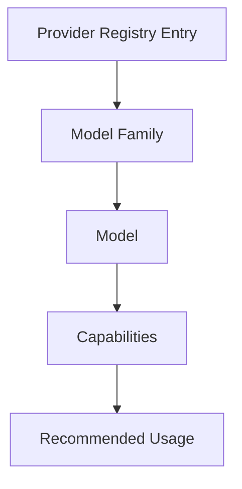

# Model Catalog

## Status

Draft conceptual model. It deliberately avoids fixed token limits, prices, and
complete model-name lists because those facts change independently.

## Purpose

The Model Catalog gives Resource Manager, Decision Engine, and AI Router a
provider-neutral way to understand what models are available, what they can do,
and which uses are appropriate.

It separates model identity from provider products and access surfaces.

## Conceptual Hierarchy

## Provider Registry Entry

Represents the product, runtime, platform, or gateway through which a model can
be discovered or used.

Key concepts:

- stable registry identifier;
- registry kind;
- owning organization or project;
- authentication and access surfaces;
- discovery and adapter references;
- health and quota relationship.

One Model may be exposed through several entries. One entry may expose many
providers' models.

## Model Family

Groups related models under a stable conceptual lineage without assuming every
variant has identical capabilities.

Key concepts:

- stable family identifier;
- originating organization;
- general interaction category;
- lifecycle state;
- official source;
- known variant-discovery method.

Examples in documentation should prefer families over volatile aliases.

## Model

Represents an observed, selectable model identity.

Key concepts:

- provider-native identifier;
- family reference;
- serving entry and surface;
- version or snapshot identity when available;
- lifecycle: current, preview, deprecated, retired, or unknown;
- capability-profile reference;
- observation time and source.

The catalog does not assume a model with the same marketing name behaves
identically across providers or gateways.

## Capabilities

A Capability Profile records provider-neutral facts:

- supported input and output modalities;
- reasoning and latency category;
- context-size category: small, medium, large, very large, or unknown;
- tool/function-calling support;
- structured-output support;
- code, browser, shell, file, or computer-use support at the product surface;
- MCP client or server support at the product surface;
- streaming and background-operation support;
- privacy, region, or deployment constraints;
- source, confidence, and last verified time.

Capabilities belong to a Model plus serving surface. Product tools are not
mistaken for intrinsic model capabilities.

## Recommended Usage

Recommended Usage is reviewed policy metadata, not provider marketing.

It may describe:

- task categories;
- required quality, latency, and cost class;
- context and tool needs;
- local, hosted, or gateway preference;
- human-review requirement;
- known unsuitable uses;
- evidence and review date.

Decision Engine uses this metadata when proposing a plan. AI Router's Model
Router submodule combines it with the approved execution step and Resource
Manager eligibility. The catalog never chooses the plan or model.

## Dynamic Discovery

Dynamic facts should be discovered through official APIs or approved adapters
where possible:

- current model inventory;
- lifecycle and deprecation;
- context metadata;
- modalities;
- tool parameters;
- price class;
- provider health.

Discovery results are snapshots. They do not mutate historical routing records.

## Stable and Volatile Facts

| Prefer stable documentation | Discover or verify dynamically |
| --- | --- |
| family identity and owner | exact available model aliases |
| capability categories | exact context and output limits |
| access-surface type | current plan availability |
| authentication mode | current price |
| provider kind | quota and rate windows |
| policy meaning | preview and deprecation state |

## Identity and Alias Rules

- Registry identifiers are stable and internal to ai-manager.
- Provider aliases remain provider facts.
- A mutable alias records the observed target when a decision is made.
- Deprecated identities remain available for historical explanation.
- Gateway model identity includes both origin and serving path.
- Local open-weight models include runtime and artifact identity where known.

## Unknown and Conflicting Capability

- Unknown is not false.
- Conflicting sources retain provenance and authority.
- A required unknown capability makes the model ineligible unless policy permits
  explicit human override.
- Marketing claims alone do not establish a routing capability.
- Capability changes trigger catalog review and future routing reevaluation, not
  retroactive history changes.

## Related Documents

- [Provider Registry](PROVIDERS.md)
- [Provider Abstraction](PROVIDER_ABSTRACTION.md)
- [Capability Matrix](CAPABILITY_MATRIX.md)
- [Provider Selection Guide](PROVIDER_SELECTION_GUIDE.md)
- [Model Router Research](../research/MODEL_ROUTER.md)
